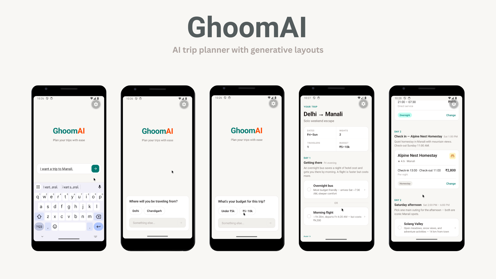
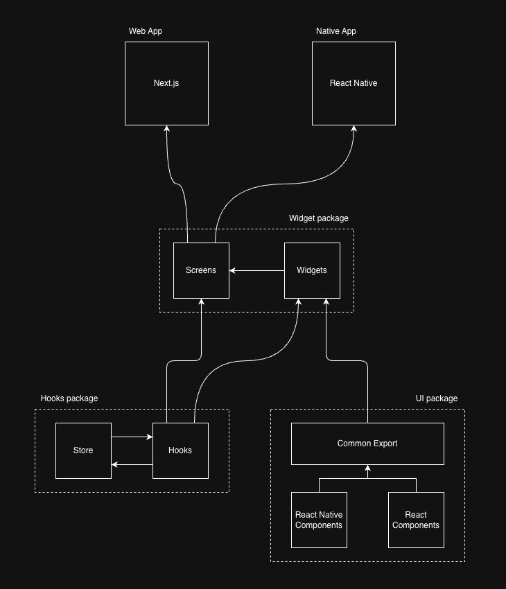
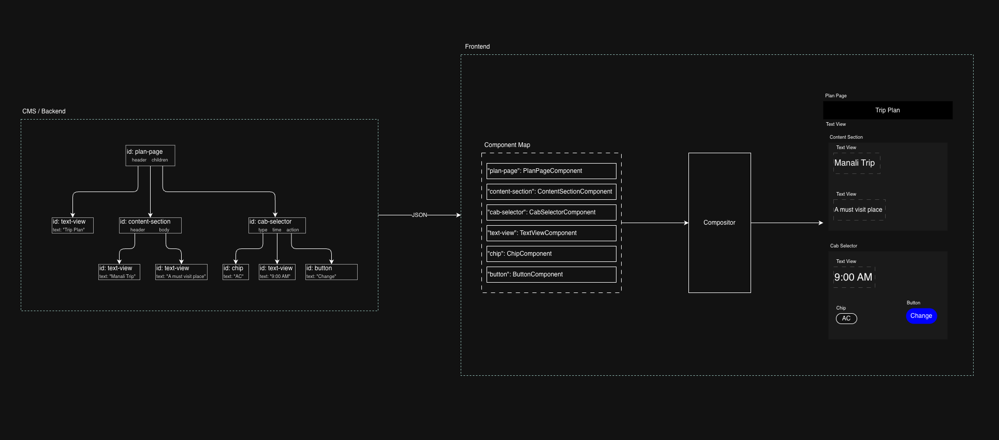
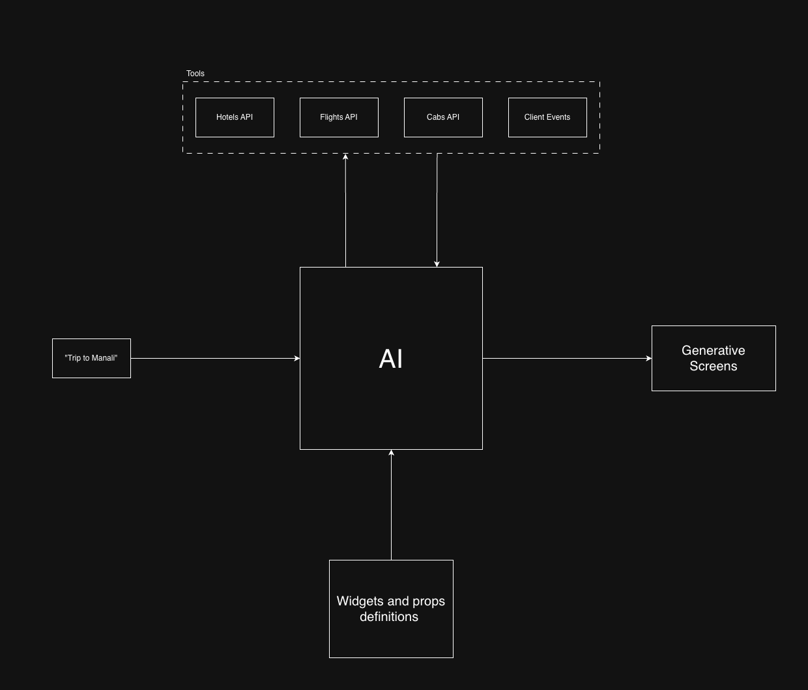

# GhoomAI

AI-powered trip planner built as a React Universal monorepo. Describe a trip in natural language and get a structured screen — headers, timelines, transport offers, hotel choices, activity options — rendered from a shared widget codebase on **web** (Next.js) and **mobile** (Expo). Shared UI and business logic live in `packages/`; platform apps are thin routing shells.



## How it works

GhoomAI combines three ideas:

1. **React Universal architecture** — one widget and screen codebase for web and mobile; only atoms (`@repo/ui`) split by platform at bundle time.
2. **Server-driven UI** — screens are `ContentItem` JSON trees resolved through a component registry and `ContentRenderer`.
3. **AI orchestration** — Claude calls registered travel search tools, streams progress over SSE, and returns the same JSON shape the renderer already understands.







Write-up: [docs/dev-to-generative-layouts.md](docs/dev-to-generative-layouts.md)

Implementation details: [packages/widgets/ARCHITECTURE.md](packages/widgets/ARCHITECTURE.md)

## Repository layout

| Path | Layer | Responsibility |
|------|-------|----------------|
| `apps/web` | App shell | Next.js static export → Firebase Hosting |
| `apps/mobile` | App shell | Expo (iOS, Android) |
| `apps/functions` | API server | Firebase Cloud Function (`ghoomaiApi`) — all `/api/*` routes |
| `packages/types` | Types | Shared type shapes — zero dependencies |
| `packages/ui` | Atoms & molecules | Cross-platform primitives (`*.web.tsx` + `*.mobile.tsx`) |
| `packages/hooks` | Business logic | Client state and feature hooks (`@repo/hooks`) |
| `packages/widgets` | Organisms & pages | Screens, widgets, registry, renderer (`@repo/widgets`) |
| `packages/api` | Server-side | AI orchestration, travel tools, route handlers (`@repo/api`) |

## Prerequisites

- [Bun](https://bun.sh) (package manager)
- [Firebase CLI](https://firebase.google.com/docs/cli) (deploy + emulators)
- [Anthropic API key](https://console.anthropic.com/) (for AI layout generation)

For mobile preview builds, see [apps/mobile/README.md](apps/mobile/README.md) (EAS CLI, Expo account).

## Local development

```bash
bun install
```

Run each part in a separate terminal:

```bash
# API (Firebase Functions emulator) — start this first
bun run --cwd apps/functions dev

# Web (Next.js dev server)
bun run --cwd apps/web dev

# Mobile (Expo)
bun run --cwd apps/mobile start
```

### Environment setup

The web app is a **static export** in production — it has no server-side API routes. Locally, point clients at the Functions emulator.

**1. Functions** — copy `apps/functions/.env.example` → `apps/functions/.env`:

```env
ANTHROPIC_API_KEY=sk-ant-...
```

**2. Web** — copy `apps/web/.env.example` → `apps/web/.env.development.local`:

```env
NEXT_PUBLIC_API_BASE_URL=http://127.0.0.1:5001/ghoomai/us-central1/ghoomaiApi
```

**3. Mobile** — copy `apps/mobile/.env.example` → `apps/mobile/.env`:

```env
EXPO_PUBLIC_API_BASE_URL=http://127.0.0.1:5001/ghoomai/us-central1/ghoomaiApi
```

> Do not put `NEXT_PUBLIC_*` values in `apps/web/.env.local` — that file is loaded during `next build` and overrides `.env.production`.

### Verify locally

1. Open the web app (default `http://localhost:3000`).
2. Enter a prompt like *"I want a trip to Manali."*
3. Answer clarifying questions; the AI calls mock travel APIs and returns a generated layout.
4. On mobile, scan the Expo QR code and use the same API base URL.

## Deployment

Firebase project: `ghoomai` (see `.firebaserc`).

```bash
# Build + deploy everything
firebase deploy

# Deploy individually
firebase deploy --only hosting    # static web → ghoomai.web.app
firebase deploy --only functions  # API → Cloud Run
```

### Before first deploy

1. **Web** — copy `apps/web/.env.example` → `apps/web/.env.production` with your Functions URL (`https://….a.run.app`).
2. **Functions** — set the API key:
   ```bash
   firebase functions:secrets:set ANTHROPIC_API_KEY
   ```
3. **Functions** — ensure public invoker is enabled (`invoker: "public"` in `apps/functions/src/index.ts`).

Hosting predeploy runs `next build` (static export to `apps/web/out`). Functions predeploy bundles `@repo/api` via esbuild and strips workspace deps from `package.json` for Cloud Build.

### Mobile demo (EAS)

Share an installable preview APK without app stores:

```bash
cd apps/mobile
bun run build:preview          # internal Android APK
bun run update:preview -- "msg"  # OTA update after install
```

Project: [expo.dev/accounts/neetigyachahar/projects/ghoomai](https://expo.dev/accounts/neetigyachahar/projects/ghoomai)

## Scripts

```bash
bun run build          # turbo build all packages
bun run dev            # turbo dev
bun run lint           # turbo lint
bun run check-types    # turbo typecheck
```

## Assets

Architecture diagrams used in the blog and this README live in [`assets/`](assets/):

| File | Description |
|------|-------------|
| `mockups.png` | App flow — prompt, clarifying questions, generated trip layout |
| `ghoomai.drawio.png` | React Universal monorepo layers |
| `ghoomai-json.png` | Server-driven UI / JSON content tree |
| `ghoomai-ai.png` | AI orchestrator and generative layouts |
