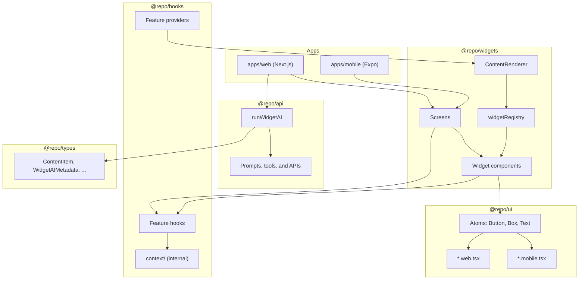
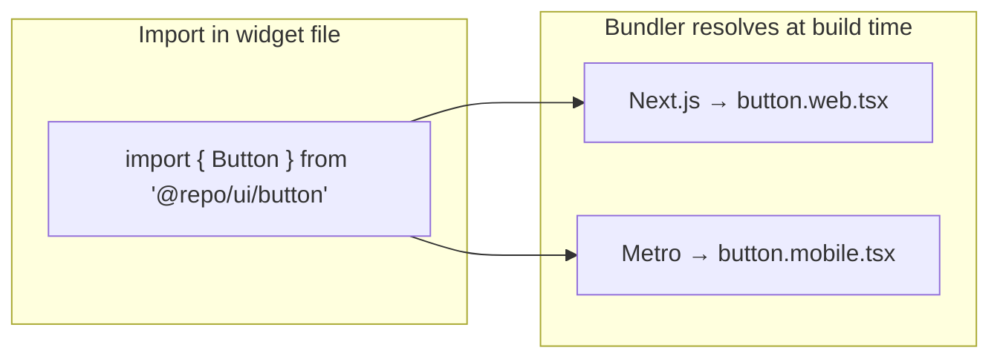
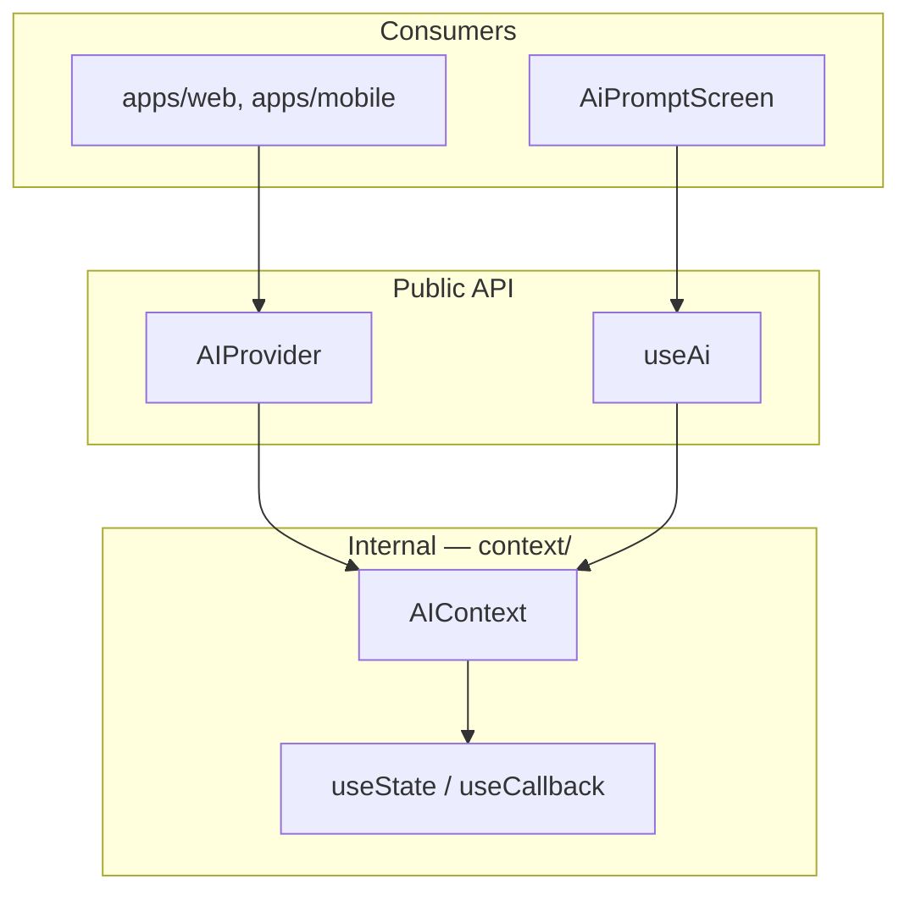
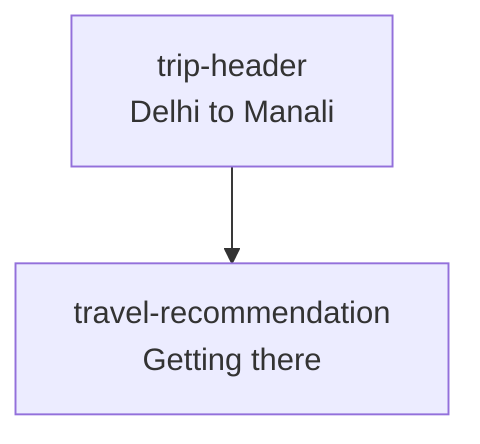
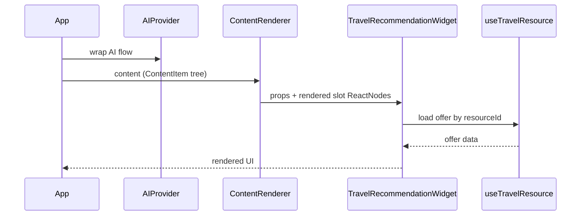

# Frontend Architecture

This document describes how shared UI, business widgets, and hooks are structured across the Ghoomai monorepo.

## Overview

The frontend is split into five packages following [atomic design](https://bradfrost.com/blog/post/atomic-web-design/) and separation-of-concerns principles:

| Layer | Package | Atomic level | Responsibility |
|-------|---------|--------------|----------------|
| Shared types | `@repo/types` | — | Cross-package type shapes only (zero dependencies) |
| Server APIs | `@repo/api` | — | Server-side orchestration: AI, external APIs, tools, and route handlers |
| Atoms & molecules | `@repo/ui` | Atoms, molecules | Platform-agnostic API with platform-specific implementations |
| Organisms & pages | `@repo/widgets` | Organisms, pages | Business UI, widget registry, screens, and tree rendering |
| Business logic & state | `@repo/hooks` | — | Context, state, and feature hooks (logic only, no UI) |

Apps (`web`, `mobile`) mount **screens** from `@repo/widgets/screens/*` and pass routing props only. They do not import `@repo/ui` directly or compose feature UI inline.



---

## Package responsibilities

### `@repo/types` — shared type shapes

- **Types only** — no runtime code, no package dependencies
- Used by `@repo/hooks`, `@repo/widgets`, and app API routes
- Examples: `ContentItem`, `WidgetAIMetadata`, `WidgetAIResponse`

```
packages/types/src/
├── content.ts
├── widget-registry.ts
├── ai.ts
└── index.ts
```

### `@repo/api` — server-side APIs and orchestration

- **Server-only** — AI orchestration, external API clients, tool definitions, and shared route handler logic
- Used exclusively by app API routes (`apps/web/app/api/*`); never imported by client hooks, widgets, or mobile
- Depends on `@repo/types` only among workspace packages
- No React, no UI, no client state

```
packages/api/src/
├── index.ts
├── run-widget-ai.ts
└── internal/
    └── build-prompt.ts
```

Future modules (AI tools, third-party APIs, data lookups) are added here as the server surface grows.

### `@repo/ui` — atoms & molecules

- Smallest reusable building blocks (buttons, layout primitives, typography, etc.)
- Each component has a **shared types file** and **two implementations**:
  - `*.web.tsx` — DOM / Tailwind (Next.js)
  - `*.mobile.tsx` — React Native (Expo)
- Platform selection happens at **bundle time** via `package.json` export conditions — no runtime switching in app code
- May include **component-scoped hooks** (e.g. `useButtonPress`) that only support that UI primitive — these stay inside `@repo/ui`, not `@repo/hooks`

```
packages/ui/src/
├── button/
│   ├── button.types.ts
│   ├── button.web.tsx
│   └── button.mobile.tsx
├── box/
│   ├── box.types.ts
│   ├── box.web.tsx
│   └── box.mobile.tsx
└── text/
    ├── text.types.ts
    ├── text.web.tsx
    └── text.mobile.tsx
```

**Export pattern** (`packages/ui/package.json`):

```json
"./button": {
  "react-native": "./src/button/button.mobile.tsx",
  "types": "./src/button/button.web.tsx",
  "default": "./src/button/button.web.tsx"
}
```

- **Next.js** resolves `default` → web implementation
- **Expo / Metro** resolves `react-native` → mobile implementation (via `customConditions: ["react-native"]` in tsconfig)



### `@repo/hooks` — business logic & state

- Owns all **business state** and **feature logic**
- Organised by feature under two internal folders:
  - `context/` — React context providers and context objects (**internal, not part of public API**)
  - `hooks/` — public hooks and provider re-exports per feature
- Widgets and apps consume **hooks only** — never import from `context/` directly
- No UI components in this package

```
packages/hooks/src/
├── index.ts
├── context/                    # internal — not exported via package.json
│   └── ai/
│       └── ai-context.tsx
└── hooks/                      # public API per feature
    └── ai/
        ├── index.ts              # exports provider + hooks
        ├── use-ai.ts
        └── use-generated-layout.ts
```

**Public exports** (`packages/hooks/package.json`):

```json
{
  "exports": {
    ".": "./src/index.ts",
    "./ai": "./src/hooks/ai/index.ts",
    "./travel": "./src/hooks/travel/index.ts"
  }
}
```

The `context/` folder is deliberately **absent from exports**. Consumers import:

```ts
import { AIProvider, useAi } from "@repo/hooks/ai";
```

**Context isolation rule:**

| Consumer | May import from `hooks/` | May import from `context/` |
|----------|--------------------------|----------------------------|
| Apps | Yes | No |
| Widgets | Yes | **No** (enforced by ESLint) |
| Other hooks (same package) | Yes | Yes (internal only) |



### `@repo/widgets` — organisms & pages

- Business-specific UI built by composing `@repo/ui` atoms
- May call **feature hooks** from `@repo/hooks/<feature>` for interactive behaviour
- Must **never** import from `@repo/hooks/context/*` (ESLint enforced)
- **Single `.tsx` file per widget** for all platforms
- Widgets are registered in a **map keyed by string ID**
- A **renderer** walks a declarative `ContentItem` tree and composes the final UI

```
packages/widgets/src/
├── types.ts              # re-exports from @repo/types + widget-only types
├── registry.ts
├── renderer.tsx
├── index.ts
├── widgets/
│   ├── trip-header.tsx
│   ├── travel-recommendation.tsx
│   └── plan-choice.tsx
└── screens/              # static full-page layouts (single file, all platforms)
    ├── ai-prompt-screen.tsx
    ├── ai-result-screen.tsx
    └── ai-flow-shell.tsx
```

**Screens** are sibling to `widgets/`. Each screen is a **single cross-platform `.tsx` file** used by both web and mobile apps. Screens compose `@repo/ui` atoms and call `@repo/hooks/<feature>` hooks. Apps mount screens — they never build forms, inputs, or widget trees inline.

Screens may wrap feature providers (e.g. `AiFlowShell` reads the widget registry and mounts `AIProvider`) so apps stay thin routing shells.

---

## Widget registry

Every widget is registered by a unique string key in `widgetRegistry`:

```ts
export const widgetRegistry: Record<string, WidgetComponent> = {
  "trip-header": TripHeaderWidget,
  "travel-recommendation": TravelRecommendationWidget,
  "plan-choice": PlanChoiceWidget,
};
```

| Key | Widget | Role |
|-----|--------|------|
| `trip-header` | `TripHeaderWidget` | Page header with trip title and stats |
| `travel-recommendation` | `TravelRecommendationWidget` | Timeline step with a travel offer |
| `plan-choice` | `PlanChoiceWidget` | Mutually exclusive pick-one step |

To add a new widget:

1. Create `packages/widgets/src/widgets/<name>.tsx`
2. Compose atoms from `@repo/ui/*`
3. Use feature hooks from `@repo/hooks/<feature>` when state/logic is needed
4. Register the component in `registry.ts` under a stable string key

---

## Content tree & renderer

Apps (or a CMS/API) pass a **declarative content object** describing the widget tree. The renderer resolves each node, recursively renders slot children, and passes them as pre-rendered `ReactNode` props.

### `ContentItem` shape

```ts
interface ContentItem {
  key: string;                        // widget ID, e.g. "trip-header"
  props: Record<string, unknown>;     // data props for the widget
  children: ContentChildren | null;   // named slots, or null
}

type ContentChildren = {
  [slot: string]: ContentItem[] | null | undefined;
};
```

### Example tree

```ts
const content: ContentItem[] = [
  {
    key: "trip-header",
    props: {
      title: "Delhi to Manali",
      stats: [
        { label: "Dates", value: "Jun 20–22" },
        { label: "Travelers", value: "2" },
      ],
    },
    children: null,
  },
  {
    key: "travel-recommendation",
    props: {
      dayLabel: "Day 1",
      resourceType: "bus",
      resourceId: "bus-del-man-1",
      sectionTitle: "Getting there",
      stepTime: "Fri 9:00 PM – Sat 7:30 AM",
    },
    children: null,
  },
];
```



### Rendering flow



**Key rules:**
- Widgets never recurse the tree — the renderer owns all tree walking
- Widgets receive **already-rendered** slot children via props
- Widgets access state via **hooks**, not context objects

---

## Cross-platform widget authoring

Widget files are written **once**. They import from `@repo/ui/*` for presentation and `@repo/hooks/<feature>` for logic.

```tsx
// packages/widgets/src/widgets/travel-recommendation.tsx
import { useTravelResource } from "@repo/hooks/travel";
import { TravelBusOffer } from "@repo/ui/travel-bus-offer";

export function TravelRecommendationWidget({ resourceType, resourceId, ... }) {
  const { data } = useTravelResource(resourceType, resourceId);
  // ...
}
```

| Concern | Where it lives |
|---------|----------------|
| DOM vs RN primitives | `@repo/ui` atom implementations |
| Tailwind / class names | `@repo/ui` web atoms + `styles.css` |
| Business state & actions | `@repo/hooks` (context internal, hooks public) |
| Business layout & slots | `@repo/widgets` |
| UI-only helper hooks | `@repo/ui` (component-scoped, optional) |
| Platform conditions in widgets | Inline in widget file, only when needed |

---

## App integration

Apps are **routing shells**. They mount screens from `@repo/widgets/screens/*`, pass navigation callbacks, and (for web) host server API routes. They never compose `@repo/ui` atoms or call feature hooks for UI directly.

### Web (`apps/web`)

```tsx
// apps/web/app/ai/layout.tsx — shared provider for prompt + result routes
import { AiFlowShell } from "@repo/widgets/screens/ai-flow";

export default function AiLayout({ children }) {
  return <AiFlowShell>{children}</AiFlowShell>;
}

// apps/web/app/ai/page.tsx
"use client";
import { AiPromptScreen } from "@repo/widgets/screens/ai-flow";
import { useRouter } from "next/navigation";

export default function Page() {
  const router = useRouter();
  return (
    <AiPromptScreen onNavigateToResult={() => router.push("/ai/result")} />
  );
}
```

- Dependencies: `@repo/widgets` (not `@repo/ui` in app code)
- Server API routes live in `apps/web/app/api/*` and import `@repo/api`
- `ANTHROPIC_API_KEY` is server-only env

### Mobile (`apps/mobile`)

Same screens, different router:

```tsx
import { AiPromptScreen } from "@repo/widgets/screens/ai-flow";
import { useRouter } from "expo-router";

export default function AiPromptRoute() {
  const router = useRouter();
  return (
    <AiPromptScreen onNavigateToResult={() => router.push("/ai/result")} />
  );
}
```

- **One screen file** for both platforms — no separate mobile screen implementations
- During dev, mobile may pass a full API URL to `AiFlowShell` (e.g. `http://localhost:3000/api/ai/layout`)

---

## Adding a new feature (checklist)

1. **`@repo/types`** — add shared types if needed (types only, no dependencies)
2. **`@repo/ui`** — create atoms/molecules with web + mobile implementations; match visual design across platforms; support desktop layout on web where relevant
3. **`@repo/widgets/widgets/`** — build business organism widget(s) using `@repo/ui` + `@repo/hooks/<feature>`
4. **`registry.ts`** — register widget key(s); use widgets in screens or as AI-generated content
5. **`@repo/widgets/screens/`** — add static full-page screen(s) as single cross-platform files
6. **`@repo/hooks`** — implement context (internal) and public hooks only
7. **`@repo/api`** — add server handlers, prompts, tools, and orchestration (when server calls are needed)
8. **Integrate** — wire hooks inside widgets/screens; apps mount screens + pass routing props; web app adds API routes that call `@repo/api`

---

## Public APIs

### `@repo/types`

| Export path | Contents |
|-------------|----------|
| `@repo/types` | `ContentItem`, `WidgetAIMetadata`, `WidgetAIResponse`, etc. |

### `@repo/api`

| Export path | Contents |
|-------------|----------|
| `@repo/api` | `runWidgetAI`, `RunWidgetAIInput` (app API routes only) |

### `@repo/hooks`

| Export path | Contents |
|-------------|----------|
| `@repo/hooks` | `AIProvider`, `useAi`, `useGeneratedLayout` |
| `@repo/hooks/ai` | `AIProvider`, `useAi`, `useGeneratedLayout` |
| `@repo/hooks/travel` | `useTravelResource` |

### `@repo/widgets`

| Export path | Contents |
|-------------|----------|
| `@repo/widgets` | `ContentRenderer`, registry helpers, types |
| `@repo/widgets/renderer` | `ContentRenderer`, `renderContentItem` |
| `@repo/widgets/registry` | `getWidgetRegistry`, `getWidgetRegistryForAI` |
| `@repo/widgets/types` | Re-exports + widget-only types |
| `@repo/widgets/screens/ai-flow` | `AiFlowShell`, `AiPromptScreen`, `AiResultScreen` |

---

## Design rules (summary)

1. **Apps mount `@repo/widgets/screens/*`** — not `@repo/ui`, not inline feature UI
2. **Atoms live in `@repo/ui`** with separate web/mobile implementations
3. **Shared types live in `@repo/types`** — zero dependencies
4. **Business state lives in `@repo/hooks`** — context is internal; hooks are the public API
5. **Widgets never import context directly** — only feature hooks from `@repo/hooks/<feature>`
6. **Widgets and screens are single-file** — one file per widget/screen for all platforms
7. **Screens are cross-platform** — web and mobile import the same screen file; only routing differs in apps
8. **Widgets compose atoms** — they do not use `react-native` or DOM primitives directly
9. **Slots are pre-rendered** — the renderer passes `ReactNode` children; widgets just place them
10. **Content is data** — AI or config drives `ContentItem` trees rendered by `ContentRenderer`
11. **Server APIs** — orchestration lives in `@repo/api`; app API routes import it; secrets stay server-only
12. **Client AI hooks** — `@repo/hooks/ai` handles client state and HTTP calls to app API routes only
13. **UI-only hooks stay in `@repo/ui`** — business hooks stay in `@repo/hooks`
